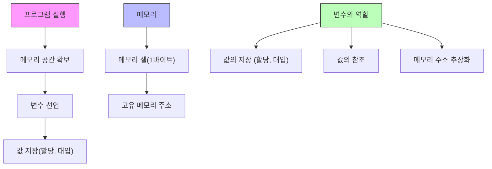

애플리케이션은 데이터를 다룬다.  이는 입력을 받아 처리하고 결과를 출력한다.
**변수는** 프로그래밍 언어에서 데이터를 관리하기 위한 핵심 개념이다.

컴퓨터는 CPU를 사용해 연산하고, 메모리를  사용해 데이터를 기억한다

메모리는 데이터를 저장할 수 있는 메모리 셀의 집합체다 하나의 크기는 1 바이트 (8비트) ㅁㅁㅁㅁ ㅁㅁㅁㅁ
컴퓨터는 메모리 셀의 크기, 즉 1바이트 단위로 데이터를 저장하거나 읽는다.

셀은 고유의 메모리 주소를 갖는다. 이는 메모리 공간의 위치를 나타낸다.  0 부터 시작해서 메모리의 크기만큼 정수로 표현된다.
컴퓨터는 모든 데이터를 2진수로 처리한다.

CPU가 연산을 하고 그 결과를 메모리에 저장하지만 저장된 값을 재사용 하려면 저장된 메모리 공간에 직접 접근해야한다.
하지만 메모리 주소를 통해 값에 직접 접근하는 것은 치명적 오류를 발생시킬 가능성이 높다. 그래서 자바스크립트는 개발자의 직접적인 메모리 제어를 허용하지 않는다.
값이 저장될 메모리 주소는 코드가 실행될 때 메모리의 상황에 따라 임의로 결정된다. 동일한 코드를 실행해도 매번 저장될 메모리 주소는 변경된다. 코드가 실행되기 전에 저장된 메모리 주소를 알 수 없다.

저장된 값을 읽어 들여 재사용하기 위해서 변수라는 메커니즘을 사용한다.

변수: 하나의 값을 저장하기 위해 확보한 메모리 공간 자체 또는 그 메모리 공간을 식별하기 위해 붙인 이름
, 값의 위치를 가르치는 상징적인 이름이다. 
변수는 언어의 컴파일러 또는 인터프리터에 의해 값이 저장된 메모리 공간의 주소로 치환되어 실행된다.

```javascript
// 변수는 하나의 값을 저장하기 위한 수단
var userID = 1;
var userName = 'Lee';

// 객체나 배열 같은 자료구조를 사용하면 여러 개의 값을 하나로 그룹화해서 하나의 값처럼 사용 가능
var user = { id: 1, name: 'Lee' };

var users = [
{ id: 1, name: 'Lee' },
{ id: 2, name: 'Kim' }
];
```



변수명은 사람을 위해 사람이 이해할 수 있는 언어로 값이 저장된 메모리 공간에 붙이는 상징적인 이름이다.
변수명으로 저장된 값의 의미를 명확히 알 수  있으므로 명확한 네이밍으로 코드를 이해하기 쉽게 하여 협업과 품질 향상에 도움을 주도록 만든다.
